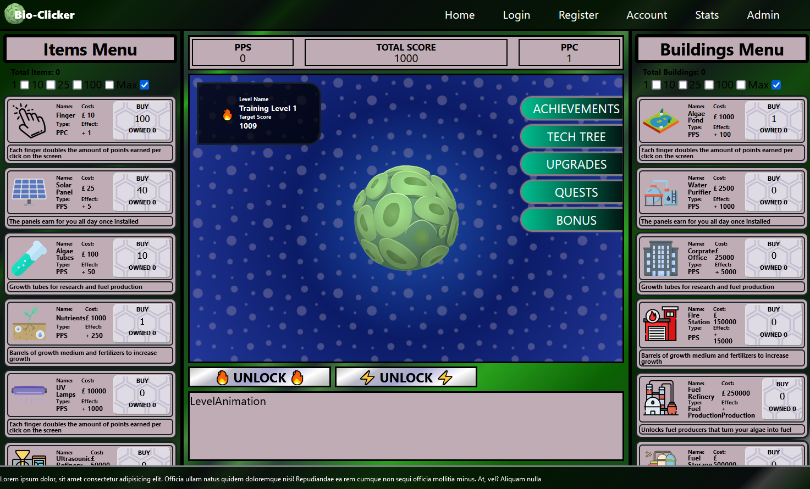
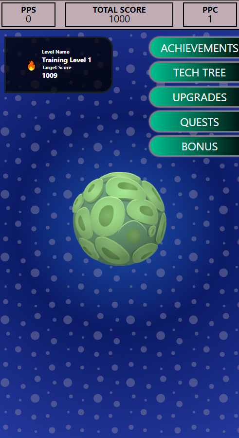

# Bio Clicker

A idle clicker game based on poular designs
A example of state manipulation and react stlying
These games are hugely popular and a good example
Canvas element for clickable enemies moving about.

Current Address [Live Bio Clicker Link](https://rococo-kleicha-53fa88.netlify.app/)

Currently the Mobile version is in poor quality. It needs a complete resdesign and new menu buttons and overflow scroll options.

## Table of contents

- [Bio Clicker](#bio-clicker)
  - [Table of contents](#table-of-contents)
  - [General info](#general-info)
  - [Game play](#game-play)
  - [Technologies](#technologies)
  - [Run this project locally](#run-this-project-locally)
    - [States](#states)

## General info

A database is not in use yet but will be and is currently found.

Server deployment with Vercel @ [https://webdesignsbytom-app.vercel.app/](https://webdesignsbytom-app.vercel.app/)

## Game play

1. Algae is the main click producor
2. Basic stats include TotalScore, PointsPerClick(PPC), PointsPerSecond(PPS)
3. TotalScore = PPC + PPS
4. Other stats
   1. Fuel - gets area
   2. Power - gets area
   3. CO2 saved - stat on power
   4. Cities Powered - stat on power
5. Each Unit of algae produces x amount of Fuel to be used later
6. Levels have a total of 'Power Produced' to win
7. Buildings and Items
   1. Bought using TotalScore points
   2. Increases PPC or PPS
   3. Option increase for Power stat
8. Cities Powered Stat can be displayed using a dark area that lights up like a city as power is produced

## Technologies

App developed with:

Frontend: React, JavaScript, Tailwind, Axios, validator

Backend: Express, Prisma, JavaScript

## Run this project locally

1. Fork this repository and clone the fork to your machine.
2. Navigate to client and server files and run
3. `npm install`
4. `npm start`

### States

1. Current PPS
2. Current PPC
3. TotalScore
4. Current Fuel Total
5. FPS fuel per second
6. Time since join
7. EnergyPerSecond EPS
8. TotalEnergy
9. Total of each building
10. Total buildins owned
11. Total of each item
12. Total items Owned
13. Total boost percentage
14. Current Level
15. Time on level
16. Prestige Level
